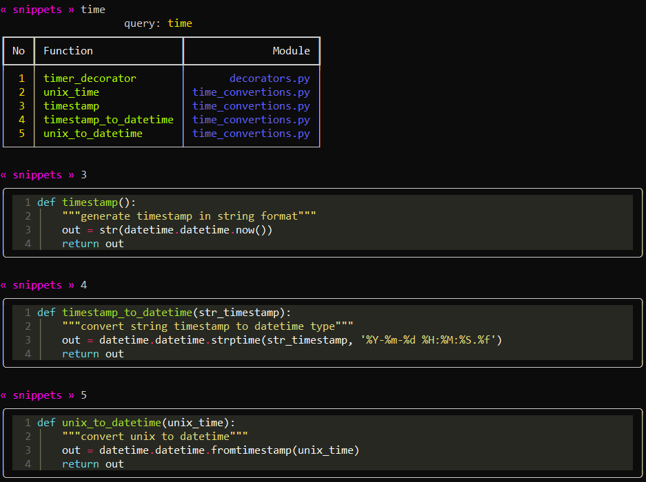

# snippets

python snippets viewer

## install

```
pip install git+https://github.com/streanger/snippets.git
```

## usage

```
snippets
```

## screenshots




## ideas

for snippets:

- functions for encryption/decryption, encoding/decoding

for code itself:

- wild search

- show code for all found queries (as option/flag)

- highlight query in function name or in code

- find by keywords/tags


